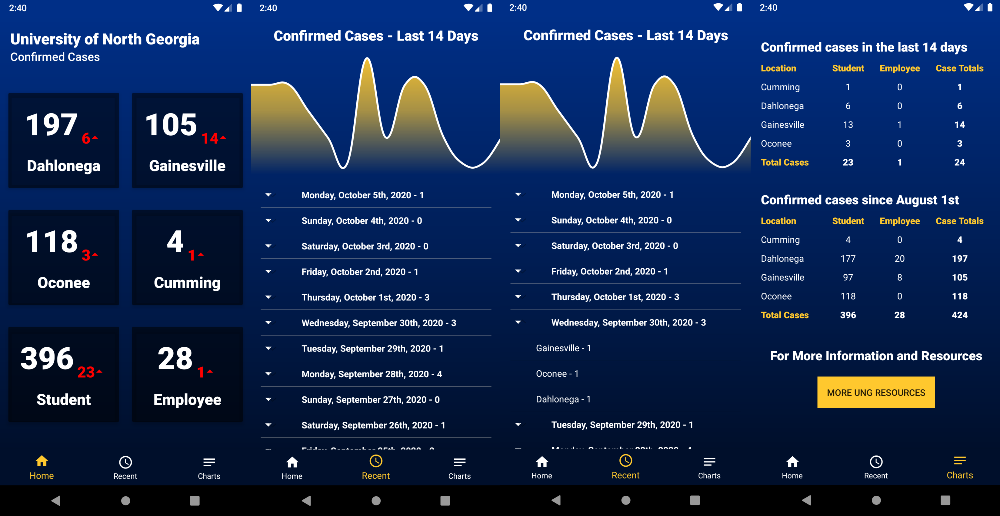

   
  <h1><strong>North Georgia Covid Tracker</strong></h1>

  <strong>A Proof-of-Concept MS SQL Server Database structure for Soccer Clubs [College Assignment]</strong>
  
  

    <strong>
      <a href="#about">About</a> •
      <a href="#screenshots">Screenshots</a> •
      <a href="#project-demo">Project Demo</a> •
      <a href="#installation">Installation</a> •
      <a href="#support">Support</a>
    </strong>
  

  

## About

The North Georgia Tracker app provides real-time data and statistics related to confirmed coronavirus cases of students and faculty at each of the University of North Georgia campuses. This app serves to aggregate the provided Covid-19 case statistics and provide a convenient outlet for staying informed on the current statistics at the University of North Georgia. 
  
All data and official counts presented within this phone app are sourced from UNG's publicly available Covid-19 resources page: 
* https://ung.edu/together/managing-covid.php

Additional information and resources for covid-related questions and contacts can be found on the UNG coronavirus page linked above.

## Screenshots

## Project Demo

## Google Play Store - Installation
This application was developed within Android Studio for installation on Android smartphones and tablets. The link to the app's store page can be found below:

* https://play.google.com/store/apps/details?id=com.brukernavn.ung_cases

This app was developed within UNG's Mobile App Development course by a group of students from UNG and does not necessarily represent the official views or policies of the university. 

## Support
For additional assistance, comments, or suggestions, please reach out to the developers at:
  
Daniel Haugen - **dlhaug7343@ung.edu**
